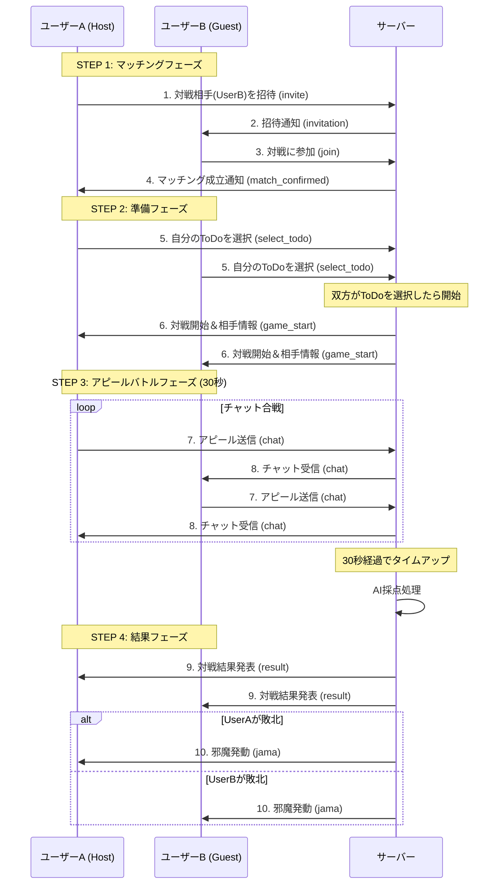

# WebSocket Protocol Specification

WebSocket URL: `wss://yum4xcxupi.execute-api.ap-northeast-1.amazonaws.com/production/`

この WebSocket は、配信者以外に配信した内容を流すものとなっています。
対戦のマッチングから対戦結果の共有、邪魔機能（Jama）のトリガーまでをリアルタイムで同期します。

## 1. 基本メッセージフォーマット (Basic Message Format)

送受信されるメッセージは全て以下の JSON 形式に従います：

```json
{
  "type": "メッセージタイプ (string)",
  "content": "データペイロード (string | object)"
}
```

## 2. フロー概要 (Sequence Diagram)



## 3. 詳細メッセージ仕様 (Detailed Message Specs)

各フェーズで送受信されるメッセージの詳細です。

### STEP 1: マッチング (Matching)

#### 1. 送信: 招待を送る (`invite`)

UserA が UserB を指定して招待します。自分の UUID (`hostId`) も含めます。

- `type`: "invite"
- `content`: { targetId, hostId }

```json
{
  "type": "invite",
  "content": {
    "targetId": "target_user_id_uuid",
    "hostId": "my_user_id_uuid"
  }
}
```

#### 2. 受信: 招待が届く (`invitation`)

UserB が招待を受け取ります。

- `type`: "invitation"
- `content`: { from: "inviter_user_id" }

```json
{
  "type": "invitation",
  "content": {
    "from": "user_a_uuid"
  }
}
```

#### 3. 送信: 参加する (`join`)

UserB が招待を受けて参加します。招待元の UserA (`hostId`) を指定します。

- `type`: "join"
- `content`: { hostId: "inviter_user_id" }

```json
{
  "type": "join",
  "content": {
    "hostId": "user_a_uuid"
  }
}
```

#### 4. 受信: マッチング成立 (`match_confirmed`)

UserA (および UserB) にマッチング完了を通知します。

- `type`: "match_confirmed"
- `content`: 対戦相手の情報など

```json
{
  "type": "match_confirmed",
  "content": {
    "opponentId": "user_b_uuid",
    "status": "ready"
  }
}
```

### STEP 2: 準備 (Preparation)

#### 5. 送信: ToDo 決定 (`select_todo`)

ユーザーが対戦に使用する ToDo を選択して送信します。

- `type`: "select_todo"
- `content`: 選択した Todo の ID (または新規入力テキスト)

```json
{
  "type": "select_todo",
  "content": {
    "todoId": "todo_uuid_123",
    "title": "洗濯機を回す"
  }
}
```

#### 6. 受信: 対戦開始 (`game_start`)

双方が ToDo を提出・完了するとサーバーから送られます。

- `type`: "game_start"
- `content`: 相手の ToDo 情報を含みます。

```json
{
  "type": "game_start",
  "content": {
    "opponentTodo": {
      "title": "掃除機をかける",
      "description": "リビング全体"
    },
    "startTime": 1670000000000
  }
}
```

### STEP 3: アピールバトル (Battle)

#### 7. 送信: チャット/攻撃 (`chat`)

自分の ToDo の正当性をアピールします。

- `type`: "chat" (または "attack")
- `content`: メッセージ本文

```json
{
  "type": "chat",
  "content": "このタスクは家族の平和に貢献します！"
}
```

#### 8. 受信: 相手のチャット (`chat`)

相手のメッセージを受信します。

- `type`: "chat"
- `content`: 相手のメッセージ本文（表示用）

```json
{
  "type": "chat",
  "content": "でも掃除機の方が部屋が綺麗になりますよ"
}
```

### STEP 4: 結果 (Result)

#### 9. 受信: 結果発表 (`result`)

AI による判定結果が届きます。

- `type`: "result"
- `content`: スコアと勝敗

```json
{
  "type": "result",
  "content": {
    "{user_a_uuid}": { "score": 85 },
    "{user_b_uuid}": { "score": 70 },
    "winner": "user_a_uuid",
    "reason": "貢献度の説明が具体的でした"
  }
}
```

#### 10. 受信: 邪魔発動 (`jama`)

敗者に対して送られます。クライアント側でこのメッセージを受け取ったら画面妨害エフェクトを発動します。

- `type`: "jama"
- `content`: 邪魔の種類や強度

```json
{
  "type": "jama",
  "content": "You Lose! Penalty Activated!"
}
```

# WebSocket-default Lambda Function Code

```Node.js24.x
import { DynamoDBClient } from "@aws-sdk/client-dynamodb";
import { DynamoDBDocumentClient, ScanCommand, UpdateCommand, GetCommand, DeleteCommand, PutCommand } from "@aws-sdk/lib-dynamodb";
import { ApiGatewayManagementApiClient, PostToConnectionCommand } from "@aws-sdk/client-apigatewaymanagementapi";
// Node.js 18以降はfetchが標準搭載

const dynamoClient = new DynamoDBClient({});
const docClient = DynamoDBDocumentClient.from(dynamoClient);

// ★★★ 環境に合わせて変更してください ★★★
const CONNECTIONS_TABLE = "Vtx-ws";
const SCORE_API_URL = "https://keydz2ocwl.execute-api.ap-northeast-1.amazonaws.com/prod/score";
// ★★★ ここまで ★★★

// AIレスポンスからJSON部分を抽出してスコアを取得するヘルパー関数
const fetchAndExtractScore = async (todoTitle, chatLog) => {
    try {
        const res = await fetch(SCORE_API_URL, {
            method: "POST",
            headers: { "Content-Type": "application/json" },
            body: JSON.stringify({
                todo: todoTitle || "No Todo",
                chat: chatLog || ""
            })
        });

        // 1. レスポンスをテキストとして取得
        const rawText = await res.text();
        console.log("AI Raw Response:", rawText);

        // 2. 正規表現でJSON部分 ({...}) を抽出 (改行を含む全文字にマッチ)
        const match = rawText.match(/\{[\s\S]*\}/);

        if (match) {
            // 3. マッチした部分をJSONパース
            const jsonStr = match[0];
            const result = JSON.parse(jsonStr);
            return { score: result.score || 0 };
        } else {
            console.warn("No JSON found in response from AI API");
            return { score: 0 };
        }
    } catch (e) {
        console.error("Score fetch/parse error:", e);
        return { score: 0 };
    }
};

export const handler = async (event) => {
    const domain = event.requestContext.domainName;
    const stage = event.requestContext.stage;
    const connectionId = event.requestContext.connectionId;

    const apiGwClient = new ApiGatewayManagementApiClient({
        endpoint: `https://${domain}/${stage}`
    });

    // レスポンス送信用ヘルパー
    const sendTo = async (connId, payload) => {
        try {
            await apiGwClient.send(new PostToConnectionCommand({
                ConnectionId: connId,
                Data: Buffer.from(JSON.stringify(payload)),
            }));
        } catch (e) {
            if (e.statusCode === 410) {
                // 接続切れの場合はDBから削除
                console.log(`Stale connection: ${connId}`);
                await docClient.send(new DeleteCommand({ TableName: CONNECTIONS_TABLE, Key: { connectionId: connId } }));
            } else {
                console.error("Failed to send message:", e);
            }
        }
    };

    // $connect, $disconnect の処理はここでは割愛（$default/メッセージ処理のみに集中）
    if (!event.body) {
        if (event.requestContext.routeKey === "$connect") {
            // $connect の初期処理 (connectionIdをテーブルにPutする処理など) が必要ですが、
            // $defaultでの処理のためにここでは単純にOKを返します。
            return { statusCode: 200, body: "Connect successful" };
        }
        if (event.requestContext.routeKey === "$disconnect") {
             // $disconnect の削除処理も本来は必要ですが、sendToの内部で410エラー時に対応します。
             return { statusCode: 200, body: "Disconnect successful" };
        }
        return { statusCode: 200, body: "No body" };
    }

    try {
        const body = JSON.parse(event.body || "{}");
        const { type, content } = body;

        // 現在の接続情報を取得 (存在しない場合は新規作成/初期接続時の$connect処理を想定)
        let myConnection = await docClient.send(new GetCommand({
            TableName: CONNECTIONS_TABLE,
            Key: { connectionId }
        })).then(res => res.Item || {});

        // --- 分岐処理開始 ---
        switch (type) {
            // -----------------------------------------------------
            // STEP 1: マッチング (Matching)
            // -----------------------------------------------------
            case "invite": {
                // 自分のUserIdを保存（$connect時に行っても良い）
                await docClient.send(new UpdateCommand({
                    TableName: CONNECTIONS_TABLE,
                    Key: { connectionId },
                    UpdateExpression: "set userId = :uid",
                    ExpressionAttributeValues: { ":uid": content.hostId }
                }));

                // targetId を持つ接続を探す (Scan使用: 本番環境ではGSI推奨)
                const scanResult = await docClient.send(new ScanCommand({
                    TableName: CONNECTIONS_TABLE,
                    FilterExpression: "userId = :target",
                    ExpressionAttributeValues: { ":target": content.targetId }
                }));

                const targetConn = scanResult.Items && scanResult.Items[0];
                if (targetConn) {
                    // 相手に招待状を送る
                    await sendTo(targetConn.connectionId, {
                        type: "invitation",
                        content: { from: content.hostId }
                    });
                }
                break;
            }

            case "join": {
                // ホストを探す
                const scanHost = await docClient.send(new ScanCommand({
                    TableName: CONNECTIONS_TABLE,
                    FilterExpression: "userId = :host",
                    ExpressionAttributeValues: { ":host": content.hostId }
                }));
                const hostConn = scanHost.Items && scanHost.Items[0];

                if (hostConn) {
                    // 相互に opponentConnectionId を保存してマッチング成立
                    // 1. 自分 (Guest) の更新
                    await docClient.send(new UpdateCommand({
                        TableName: CONNECTIONS_TABLE,
                        Key: { connectionId },
                        UpdateExpression: "set opponentConnectionId = :oid, #sts = :s",
                        ExpressionAttributeNames: { "#sts": "status" },
                        ExpressionAttributeValues: { ":oid": hostConn.connectionId, ":s": "matched" }
                    }));

                    // 2. 相手 (Host) の更新
                    await docClient.send(new UpdateCommand({
                        TableName: CONNECTIONS_TABLE,
                        Key: { connectionId: hostConn.connectionId },
                        UpdateExpression: "set opponentConnectionId = :oid, #sts = :s",
                        ExpressionAttributeNames: { "#sts": "status" },
                        ExpressionAttributeValues: { ":oid": connectionId, ":s": "matched" }
                    }));

                    // 双方に通知
                    const matchPayload = { type: "match_confirmed", content: { status: "ready" } };
                    await Promise.all([
                        sendTo(connectionId, { ...matchPayload, content: { ...matchPayload.content, opponentId: content.hostId } }), // Guestへ
                        sendTo(hostConn.connectionId, { ...matchPayload, content: { ...matchPayload.content, opponentId: "guest" } }) // Hostへ
                    ]);
                }
                break;
            }

            // -----------------------------------------------------
            // STEP 2: 準備 (Preparation)
            // -----------------------------------------------------
            case "select_todo": {
                // 自分のToDoを保存
                await docClient.send(new UpdateCommand({
                    TableName: CONNECTIONS_TABLE,
                    Key: { connectionId },
                    UpdateExpression: "set todo = :t",
                    ExpressionAttributeValues: { ":t": content }
                }));

                // 相手の状態を再取得して確認
                const updatedMyConnection = await docClient.send(new GetCommand({
                    TableName: CONNECTIONS_TABLE,
                    Key: { connectionId }
                })).then(res => res.Item || {});

                if (updatedMyConnection.opponentConnectionId) {
                    const opponentRes = await docClient.send(new GetCommand({
                        TableName: CONNECTIONS_TABLE,
                        Key: { connectionId: updatedMyConnection.opponentConnectionId }
                    }));
                    const opponent = opponentRes.Item;

                    // 相手もToDoを選択済みならゲーム開始
                    if (opponent && opponent.todo) {
                         const startTime = Date.now();

                         // 自分に開始通知 (相手のToDoを送る)
                         await sendTo(connectionId, {
                            type: "game_start",
                            content: { opponentTodo: opponent.todo, startTime }
                         });

                         // 相手に開始通知 (自分のToDoを送る)
                         await sendTo(opponent.connectionId, {
                            type: "game_start",
                            content: { opponentTodo: content, startTime }
                         });
                    }
                }
                break;
            }

            // -----------------------------------------------------
            // STEP 3: アピールバトル (Battle)
            // -----------------------------------------------------
            case "chat": {
                const opponentId = myConnection.opponentConnectionId;

                if (opponentId) {
                    // 1. 相手にチャットを転送
                    await sendTo(opponentId, {
                        type: "chat",
                        content: content
                    });

                    // 2. 自分のチャットログをDBに蓄積 (AI採点用)
                    const currentLog = myConnection.chatLog || "";
                    // ログを整形 (相手からのチャットと区別するためプレフィックスを付けても良い)
                    const newLog = currentLog + (currentLog ? "\n" : "") + `[${connectionId}] ${content}`;

                    await docClient.send(new UpdateCommand({
                        TableName: CONNECTIONS_TABLE,
                        Key: { connectionId },
                        UpdateExpression: "set chatLog = :c",
                        ExpressionAttributeValues: { ":c": newLog }
                    }));
                }
                break;
            }

            // -----------------------------------------------------
            // STEP 4: 結果 (Result) - クライアントからのトリガーを想定
            // -----------------------------------------------------
            case "finish": {
                const opponentId = myConnection.opponentConnectionId;
                if (!opponentId) break;

                // 相手の情報を取得
                const opponentRes = await docClient.send(new GetCommand({
                    TableName: CONNECTIONS_TABLE,
                    Key: { connectionId: opponentId }
                }));
                const opponent = opponentRes.Item;

                // データが揃っているか確認
                if (!myConnection.todo || !opponent?.todo) {
                    console.error("Finish command received but ToDo data is missing.");
                    break;
                }

                // --- AI採点処理 (並列実行) ---
                const [myScoreData, opScoreData] = await Promise.all([
                    // 自分のスコア計算
                    fetchAndExtractScore(myConnection.todo.title, myConnection.chatLog),
                    // 相手のスコア計算
                    fetchAndExtractScore(opponent.todo.title, opponent.chatLog)
                ]);

                // 勝敗判定
                const myScore = myScoreData.score; // 0が保証されている
                const opScore = opScoreData.score; // 0が保証されている

                const winnerId = myScore >= opScore ? connectionId : opponentId;
                const loserId = myScore < opScore ? connectionId : opponentId;

                const resultPayload = {
                    type: "result",
                    content: {
                        [connectionId]: { score: myScore },
                        [opponentId]: { score: opScore },
                        winner: winnerId
                    }
                };

                // 結果発表を双方に送信 (並列実行)
                await Promise.all([
                    sendTo(connectionId, resultPayload),
                    sendTo(opponentId, resultPayload)
                ]);

                // 敗者には「邪魔」を発動
                await sendTo(loserId, {
                    type: "jama",
                    content: "You Lose! Penalty Activated!"
                });

                break;
            }

            default:
                console.log(`Unknown message type: ${type}`);
        }

        return { statusCode: 200, body: "OK" };

    } catch (error) {
        console.error("Error processing message:", error);
        return { statusCode: 500, body: "Error processing message" };
    }
};
```
